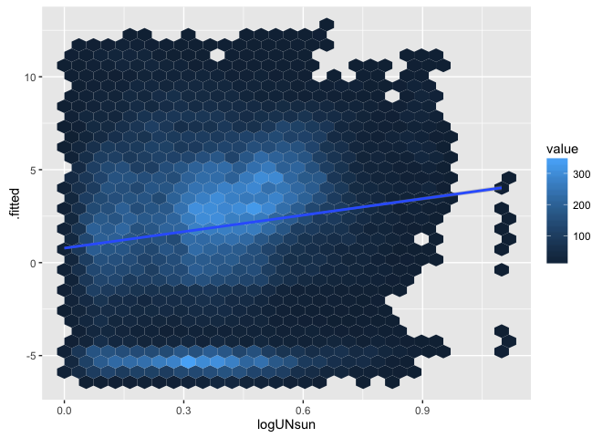
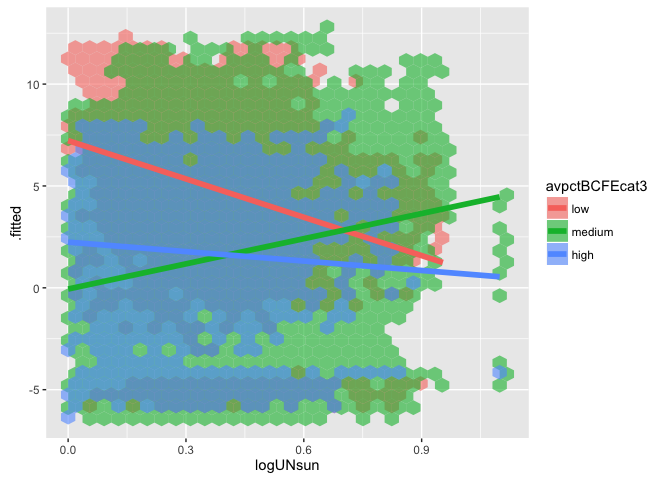

# Assignment 04
Solutions  


```r
knitr::opts_chunk$set(cache = TRUE, autodep = TRUE)
```

Libraries Used

```r
library("pols503")
library("rio")
library("ggplot2")
library("dplyr")
library("broom")
library("xtable")
```

# Data


```r
db <- import("TradeConflict.dta")
```

# Model 1

This model is similar to their Model 1 in Table 1 (p. 676):

```r
mod1 <- lm(lnrtrade ~ lnrpciab + avremote + landlocked + island + 
              landratio + pciratio + jointdem + laglnrtrade +
              lnrgdpab + lndist + logUNsun * avpctBCFE, 
           data = db)
```

**A:** Create a new variable `avpctBCFEcat3` by splitting the variable `avpctBCFE` into 3 categories. 


```r
db <- mutate(db, avpctBCFEcat3 = cut(x = avpctBCFE, breaks = 3, 
                                     labels = c("low", "medium", "high")))
```

**B:** Run a new version of `mod1` (`mod2`) but in this case ignore the interaction effect between the variables `logUNsun` and `avpctBCFE`, and substitute the variable `avpctBCFE` for the new categorical you just created.


```r
mod2 <- lm(lnrtrade ~ lnrpciab + avremote + landlocked + island + 
              landratio + pciratio + jointdem + laglnrtrade +
              lnrgdpab + lndist + logUNsun + avpctBCFEcat3, 
           data = db)
```

**C:** Plot the predicted values of the model `mod2` against the covariate `logUNsun`. Draw a linear regression line on it.


```r
pred_mod2 <- augment(mod2)
ggplot(pred_mod2, aes(x = logUNsun, y = .fitted)) + 
  stat_binhex() +
  geom_smooth(method = "lm")
```



**D:** If you used `geom_point()` in the previous plot, you probably saw that there are a lot of data points. Replicate the same plot using `stat_binhex()` instead of `geom_point()`. You can find the documentation [here](http://docs.ggplot2.org/0.9.3/stat_binhex.html).


**E:** Take a look at the plot and at the coefficient for `logUNsun` in `mod1b`. What can you say about the relationship betweeh this covariate and the outcome variable `lnrtrade`?

**F:** Replicate the same plot (`logUNsun` v. fitted values of `mod1b`) but in this case use again `geom_point()` and color the dots differently depending on their values for `avpctBCFEcat3`. Make sure you also plot 3 different lines describing the relationship between `logUNsun` and the predicted values of `lnrtrade` for each group of `avpctBCFEcat3`. What do you see? How would you interpret this new plot?


```r
ggplot(pred_mod2, aes(x = logUNsun, y = .fitted, fill = avpctBCFEcat3)) + 
  stat_binhex(alpha = 0.6) +
  geom_smooth(method = "lm", aes(color = avpctBCFEcat3), lwd = 2, se = FALSE)
```



**G:** Run a new model (`mod3`) similar to `mod2` but in this case interact the variables `logUNsun` and `avpctBCFE`.


```r
mod3 <- lm(lnrtrade ~ lnrpciab + avremote + landlocked + island + 
              landratio + pciratio + jointdem + laglnrtrade +
              lnrgdpab + lndist + logUNsun * avpctBCFEcat3, 
           data = db)
```

**H:** Keeping all the control variables at their means, calculate the predicted values for the following scenarios:

| # | `logUNsun`     |     `avpctBCFE` |
|:----|:---------|:-------|
| 1 | 0     | low |
| 2 | 1     | low |
| 3 | 0     | medium |
| 4 | 1     | medium |
| 5 | 0     | high |
| 6 | 1     | high |


```r
controls <- c("lnrpciab", "avremote", "landlocked", "island", 
              "landratio", "pciratio", "jointdem", "laglnrtrade",
              "lnrgdpab", "lndist")
scenarios <- data.frame(logUNsun = rep(c(0,1), 3),
                        avpctBCFEcat3 = c(rep("low", 2), rep("medium", 2),
                                      rep("high", 2)))
for (var in controls) {
  scenarios[,var] <- mean(db[,var], na.rm = TRUE)
}
pred_scenarios <- predict(mod3, newdata = scenarios)
```

**I:** Calculate the following:

    - `dif1`: Difference between the predicted values of scenarios 2 and 1: (`logUNsun` == 1 & `avpctBCFE` == low) - (`logUNsun` == 0 & `avpctBCFE` == low).
    - `dif2`: Difference between the predicted values of scenarios 4 and 3: (`logUNsun` == 1 & `avpctBCFE` == medium) - (`logUNsun` == 0 & `avpctBCFE` == medium).
    - `dif3`: Difference between the predicted values of scenarios 6 and 5: (`logUNsun` == 1 & `avpctBCFE` == high) - (`logUNsun` == 0 & `avpctBCFE` == high).
    - `dif4`: Difference between the predicted values of scenarios 3 and 1: (`logUNsun` == 0 & `avpctBCFE` == medium) - (`logUNsun` == 0 & `avpctBCFE` == low).
    - `dif5`: Difference between the predicted values of scenarios 5 and 1: (`logUNsun` == 0 & `avpctBCFE` == high) - (`logUNsun` == 0 & `avpctBCFE` == low).
    - `dif6`: Difference between `dif2` and `dif1`.
    - `dif7`: Difference between `dif3` and `dif1`.
    

```r
dif1 <- pred_scenarios[2] - pred_scenarios[1]
dif2 <- pred_scenarios[4] - pred_scenarios[3]
dif3 <- pred_scenarios[6] - pred_scenarios[5]
dif4 <- pred_scenarios[3] - pred_scenarios[1]
dif5 <- pred_scenarios[5] - pred_scenarios[1]
dif6 <- dif2 - dif1
dif7 <- dif3 - dif1
```
 
**J:** Explain in your own words what do all these differences represent.

  - `dif1`: The slope of `lnrtrade ~ logUNsun` when we only consider dyads where `avpctBCFE` == low.
  - `dif2`: The slope of `lnrtrade ~ logUNsun` when we only consider dyads where `avpctBCFE` == medium.
  - `dif3`: The slope of `lnrtrade ~ logUNsun` when we only consider dyads where `avpctBCFE` == high.
  - `dif4`: The difference in `lnrtrade` between dyads where `avpctBCFE` is low and dyads where `avpctBCFE` is high, when there is no conflicting interests between the countries (`logUNsun` == 0).
  - `dif5`: The difference in `lnrtrade` between dyads where `avpctBCFE` is low and dyads where `avpctBCFE` is high, when there is no conflicting interests between the countries (`logUNsun` == 0).
  - `dif6`: The difference between the slopes of `lntrade ~ logUnsun` when `avpctBCFE` is medium and `avpctBCFE` is low 
  - `dif7`: The difference between the slopes of `lntrade ~ logUnsun` when `avpctBCFE` is high and `avpctBCFE` is low 
  
**K:** Create a dataset (`differences`) with all these differences


```r
differences <- data.frame(dif1, dif2, dif3, 
                          dif4, dif5, dif6, dif7)
differences
```

```
##        dif1        dif2       dif3       dif4        dif5       dif6
## 2 0.6507081 -0.08007327 -0.3476271 0.04524175 -0.08913526 -0.7307814
##         dif7
## 2 -0.9983352
```

**L:** Create and print a table showing the `mod1` coefficients, standard errors, t-statistic and p.value for only the `Intercept` and the covariates: `logUnsun`, `avpctBCFEcat3`, and their interactions. 


```r
regtab3 <- tidy(mod3)
regtab3 <- regtab3[c(1,12:nrow(regtab3)),]
regtab3
```

```
##                            term    estimate  std.error   statistic
## 1                   (Intercept) -4.35914077 0.24857807 -17.5363048
## 12                     logUNsun  0.65070810 0.11036960   5.8957183
## 13          avpctBCFEcat3medium  0.04524175 0.05091200   0.8886265
## 14            avpctBCFEcat3high -0.08913526 0.06447025  -1.3825796
## 15 logUNsun:avpctBCFEcat3medium -0.73078137 0.11457157  -6.3783834
## 16   logUNsun:avpctBCFEcat3high -0.99833520 0.17212208  -5.8001576
##         p.value
## 1  1.118084e-68
## 12 3.750183e-09
## 13 3.742074e-01
## 14 1.667989e-01
## 15 1.802485e-10
## 16 6.657977e-09
```

**M:** Compare the coefficients to the `differences` you previously calculated. Can you now interpret the coefficients?

**N:** Predict the following 300 scenarios:

| # | `logUNsun`     |     `avpctBCFE` |
|:----|:---------|:-------|
| 1 |`min(logUNsun)`     | low |
| ... | ...     | low |
| 100 | `max(logUNsun)`     | low |
| 101 |`min(logUNsun)`     | medium |
| ... | ...     | medium |
| 200 | `max(logUNsun)`     | medium |
| 201 |`min(logUNsun)`     | high |
| ... | ...     | high |
| 300 | `max(logUNsun)`     | high |


